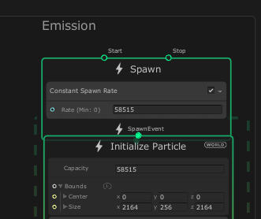
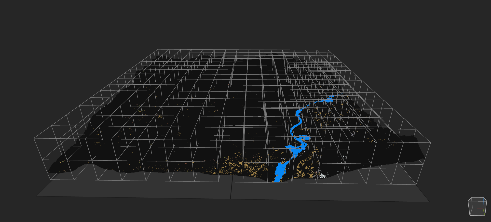

# VoxToVFX

## Requirements

- Unity 2019.3 (beta)
- VFX Graph
- HDRP
- Enable Eperimental Operators/Blocks (Edit > Preferences > Visual Effects)

## What is VoxToVFX ? 

VoxToVFX allows you to import a MagicaVoxel project into Unity using the new VFX Graph.
No mesh is created, so the import process for huge world is very quick ! All voxels are particles rendered on the GPU.
It support also world regions of MagicaVoxel so you can import world bigger than 126^3.

## How to use it ? 

You just need to put your .vox file into your project. The import process will start automatically. 
It will create a pair of texture for each materials you have. 

Then you have to assign the TextureMap in the inspector : 

Don't forget the adjust the capacity of your Initialize Particles

## Renders

(Unity)

(MagicaVoxel)

