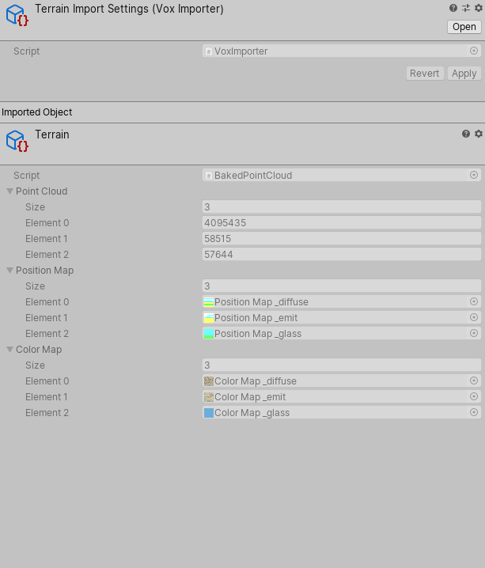
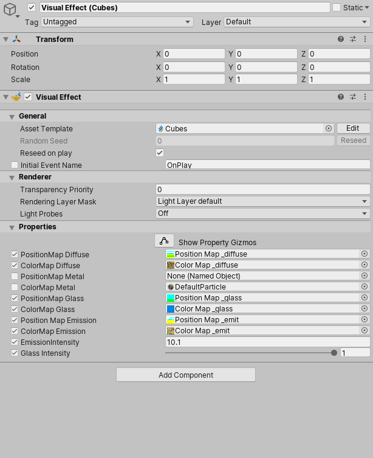

# VoxToVFX

## Requirements

- Unity 2021.2
- VFX Graph
- HDRP
- Enable Eperimental Operators/Blocks (Edit > Preferences > Visual Effects)

## What is VoxToVFX ? 

VoxToVFX allows you to import a MagicaVoxel project into Unity using the new VFX Graph.
No mesh is created, so the import process for huge world is very quick ! All voxels are particles rendered on the GPU.
It support also world regions of MagicaVoxel so you can import world bigger than 126^3.

## How to use it ? 

You need to convert first your vox file at the runtime. This conversion step is very quick and it convert your files into different chunks with 3 levels of details. 
Once your model is converted, a .zip file is created: it contains all the chunks data. 

Then you can import the data. 

## TODO

- Add collisions with the camera
- Add support for transparency material
- Add support for cloud material
- Add support for realtime raytracing (will need Unity 2022.2 in the future)

